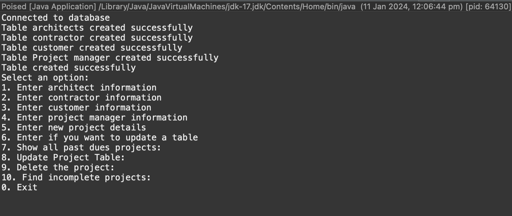

# Poised Data Management System 

## Poised DBMS Menu



## Description

The Poised project is a comprehensive Java application designed for efficient management and interaction with a MySQL database, specifically tailored for project management. It offers a user-friendly interface to handle various aspects of project administration. The program's key features include:

1. Project Data Entry: Allows users to input new project details, encompassing all critical aspects of a project.

2. Stakeholder Information Management: Facilitates the entry of essential information for various stakeholders such as architects, contractors, customers, and project managers.

3. Update Capability: Users can update existing information in the database, ensuring that all project data remains current and accurate.

4. Project Monitoring: The application provides options to track and display overdue projects, a crucial feature for effective project management.

5. Project Modification and Deletion: Enables users to modify details in the Project Table or delete projects, allowing for flexible data management.

6. Project Completion Tracking: Offers the functionality to find and list all incomplete projects, assisting in project completion and monitoring.

This program is ideal for users who require a systematic approach to managing project details and stakeholder information. Its integration with MySQL enhances data handling efficiency, making it a reliable tool for database-driven project management.

Whether it's for small-scale personal projects or larger, more complex operations, the Poised application provides a solid foundation for managing project-related information in an organised and accessible manner.

For a detailed understanding of the program's structure and database layout, please view the [Poised Database Management System Diagram ERD](Poised%20Diagram.drawio.pdf). It provides a visual representation of the relationships between the different sets of data.


## Table of Contents

- [Installation](#installation)
- [Requirements](#requirements)
- [Credits](#credits)

## Installation

Follow the steps below to install, configure, and get the project running locally on your system.

```bash
# Copy the following code in your terminal

# Clone the repository
git clone https://github.com/M311HAN/PoisePMS.git

# Navigate into the cloned directory
cd PoisePMS

```
## Requirements

- Java JDK 8 or above
- MySQL Server 5.7 or above

## Credits

This project was created by Melihhan (https://github.com/M311HAN).For more details, questions, or feedback, reach out to me.
